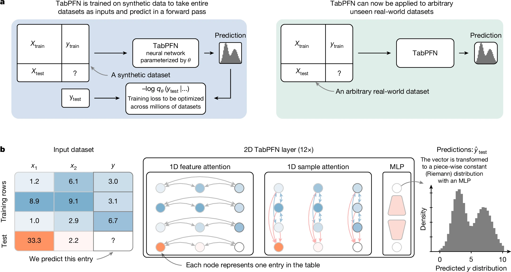

 
 

<strong>Discover how researchers and practitioners are really using <a href="https://www.nature.com/articles/s41586-024-08328-6">TabPFN</a> across science and industry.</strong>
 
 

# Awesome TabPFN Use Cases

A curated list of applications of the tabular foundation model [TabPFN](https://www.nature.com/articles/s41586-024-08328-6), grouped by industry.

## Contents

- [Healthcare and Life Sciences](#healthcare-and-life-sciences) — 103 use cases
- [Financial Services, Banking, and Insurance](#financial-services-banking-and-insurance) — 9 use cases
- [Energy and Utilities](#energy-and-utilities) — 27 use cases
- [Industrial and Manufacturing](#industrial-and-manufacturing) — 43 use cases
- [Other Industries](#other-industries) — 35 use cases

## Healthcare and Life Sciences

| # | Application | Link |
|---|-------------|-------|
| 1 | TabPFN enabled non-invasive early detection of pancreatic cancer by integrating NMR metabolomics with clinical and protein biomarkers | [Paper](https://www.nature.com/articles/s41467-026-69426-9) |
| 2 | TabPFN enables highly accurate and cost-efficient molecular property prediction by pairing in-context learning with frozen molecular embeddings and descriptor | [Paper](https://arxiv.org/abs/2604.16123) |
| 3 | TabPFN enabled robust prediction of silica nanoparticle cytotoxicity | [Paper](https://www.nature.com/articles/s41598-025-33872-0) |
| 4 | TabPFN was combined with BulkFormer to improve prediction accuracy of post-transplant kidney function for better assessment of organ viability during machine perfusion or cold storage | [Paper](https://doi.org/10.21203/rs.3.rs-9242336/v1) |
| 5 | TabPFN enhances survival analysis, leading to superior performance compared to specialized methods | [Paper](https://arxiv.org/pdf/2603.29475) |
| 6 | TabPFN demonstrated superior performance and translational feasibility for liver fibrosis staging | [Paper](https://www.cell.com/cell-reports-medicine/fulltext/S2666-3791(26)00143-6) |
| 7 | TabPFN was leveraged in cardiovascular disease diagnosis | [Paper](https://doi.org/10.1038/s41598-026-35451-3) |
| 8 | TabPFN enabled accurate prediction of ALM from multimodal clinical data and improved sarcopenia screening by maintaining robust performance despite missing modalities | [Paper](https://doi.org/10.1186/s12967-026-08079-0) |
| 9 | TabPFN was employed in the winning solution for predicting walking function | [Paper](https://doi.org/10.46292/sci25-00137) |
| 10 | TabPFN demonstrated high accuracy and specificity in matching cell line transcriptomes to reference kidney cell types using curated kidney marker gene lists, enhancing robust assessment of cell line identity | [Paper](https://doi.org/10.64898/2026.03.30.715265) |
| 11 | TabPFN was used to enhance prediction accuracy of protein coupling based on structural features, improving biological insight into protein interactions | [Paper](https://www.biorxiv.org/content/10.64898/2026.03.07.710286v1) |
| 12 | TabPFN supports risk stratification and adverse event prediction in chemotherapy-based stem cell mobilization, enabling improved ward management and resource allocation | [Paper](https://www.nature.com/articles/s41746-026-02394-y) |
| 13 | TabPFN used with other ML models to improve radiomics-based breast cancer diagnosis, enhancing feature-combination performance and classification accuracy | [Paper](https://www.nature.com/articles/s41598-026-40472-z) |
| 14 | TabPFN enhances model interpretability and accuracy in differentiating complex spinal infections, aiding clinical decision-making in ambiguous diagnostic cases | [Repo](https://github.com/Smallriver2024/STBNet) |
| 15 | TabPFN enables improved data quality and predictive model reliability by integrating unstructured clinical text with automated pipelines, enhancing early disease prediction and clinical decision-making | [Paper](http://arxiv.org/abs/2603.28167) |
| 16 | TabPFN improved severity classification performance in diabetic retinopathy, supporting more accurate staging and treatment planning | [Paper](https://www.sciencedirect.com/science/article/pii/S1572100026001225) |
| 17 | TabPFN was integrated into the multimodal MuCB-tabpfn framework, enabling high predictive accuracy in estimating pollutant concentrations in human blood | [Paper](https://www.sciencedirect.com/science/article/pii/S0147651326003842) |
| 18 | TabPFN enables better generalization and accuracy in modeling complex drug formulation data, improving AI-driven formulation design workflows | [Paper](https://www.sciencedirect.com/science/article/pii/S0168365926002622) |
| 19 | TabPFN enables state-of-the-art real-time stress detection by enhancing accuracy and interpretability of multimodal physiological and sensor data | [Repo](https://github.com/Rishabhmannu/MultiModal-Stress-Detection-ML) |
| 20 | TabPFN was applied as a robust and data-efficient alternative for tabular learning in drug discovery, improving performance on small and medium datasets and under out-of-distribution conditions | [Paper](https://doi.org/10.1021/acs.jcim.5c02823) |
| 21 | TabPFN was used to enhance clinical risk prediction from electronic health records by providing robust modeling under real-world constraints, improving prognosis accuracy and reliability | [Paper](https://doi.org/10.21203/rs.3.rs-9085469/v1) |
| 22 | TabPFN achieved the highest performance in predicting BCRL risk with strong minority-class discrimination and accurate calibration | [Paper](https://doi.org/10.1186/s12874-026-02805-4) |
| 23 | TabPFN achieved strong generalization performance in predicting adsorption capacity in zeolites, with physically meaningful interpretability | [Paper](https://doi.org/10.1021/acs.jpcc.5c08611) |
| 24 | TabPFN achieved superior discriminative performance in predicting RSA risk by integrating multidimensional clinical data into accurate and interpretable screening models | [Paper](https://doi.org/10.3389/fimmu.2026.1774359) |
| 25 | TabPFN was used to encode structured EHR data for predicting peak VO₂ and identifying high-risk heart failure patients | [Paper](https://doi.org/10.1038/s41746-026-02493-w) |
| 26 | TabPFN provided highly accurate predictions of donor mobilization success using baseline and post-mobilization variables, facilitating early triage and improved transplantation outcomes | [Paper](https://doi.org/10.1016/j.jtct.2026.02.016) |
| 27 | TabPFN was integrated into the FocalTab framework to improve classification accuracy, handle class imbalance, and support early identification of adolescent alcohol use | [Paper](https://doi.org/10.64898/2026.02.24.26347002) |
| 28 | TabPFN demonstrated strong robustness in cross-cohort microbiome disease prediction under domain shift, maintaining competitive performance across datasets | [Paper](https://doi.org/10.21203/rs.3.rs-8912605/v1) |
| 29 | TabPFN was used as a meta-learner combining predictions of multiple base models to capture complex interactions and enhance early coronary artery disease prediction accuracy | [Paper](https://doi.org/10.21203/rs.3.rs-8239358/v1) |
| 30 | TabPFN enables Bayesian inference via in-context learning without per-dataset training, improving accuracy, calibration, and inference speed in scientific disease modeling tasks | [Paper](https://doi.org/10.32942/x2vq10) |
| 31 | TabPFN was extended to multimodal learning through MMPFN, enabling effective integration of non-tabular modalities with structured clinical data | [Paper](http://arxiv.org/abs/2602.20223v2) |
| 32 | TabPFN enables unified Bayesian modeling to improve bioactivity prediction across the ChEMBL database, supporting more efficient drug discovery pipelines | [Paper](https://doi.org/10.26434/chemrxiv.15000292/v1) |
| 33 | TabPFN was used for effective differentiation between psychotic and non-psychotic major depression, improving classification accuracy and supporting psychiatric diagnosis | [Paper](https://doi.org/10.1016/j.jad.2026.121454) |
| 34 | TabPFN enables more accurate and efficient causal inference to aid early diagnosis and understanding of Long COVID | [Repo](https://github.com/SindyPin/TACO) |
| 35 | TabPFN was utilized to improve clinical risk prediction models on MIMIC-III data, enhancing both accuracy and efficiency | [Repo](https://github.com/AhmedAlMarouf/FoundationModel_on_Mimic3_ClinRisk) |
| 36 | TabPFN replaced an underperforming deep learning approach in glioblastoma trial matching, achieving significant accuracy gains in few-shot clinical prediction settings | [Paper](https://doi.org/10.5281/zenodo.17774559) |
| 37 | TabPFN outperformed current methods in predicting HFNC therapy outcomes and demonstrated potential for improved performance with additional clinical measurements | [Paper](https://doi.org/10.1186/s13054-025-05765-1) |
| 38 | TabPFN was used in a hybrid model combining radiomics and deep learning features to improve risk stratification for post-TIPS hepatic encephalopathy | [Paper](https://doi.org/10.1007/s12072-025-10934-z) |
| 39 | TabPFN was fine-tuned as a proxy model to predict synthetic likelihood of hMOFs, enabling high-fidelity large-scale screening in materials-related biomedical contexts | [Paper](https://doi.org/10.1002/adfm.202519565) |
| 40 | TabPFN improved intra-European ancestry prediction accuracy when combined with ML-based marker selection, outperforming traditional approaches | [Paper](https://doi.org/10.1101/2025.11.08.687358) |
| 41 | TabPFN improves renal tumor classification accuracy in CT radiomics by effectively handling small, high-dimensional datasets without extensive tuning | [Paper](https://doi.org/10.21037/qims-2025-1132) |
| 42 | TabPFN demonstrates competitive performance as a count-based model for clinical prediction on structured EHR data compared to transformer-based pipelines | [Paper](http://arxiv.org/abs/2511.00782v1) |
| 43 | TabPFN improves empathy detection accuracy and cross-subject generalization in human-centered video datasets | [Paper](http://arxiv.org/abs/2504.10808v2) |
| 44 | TabPFN enables accurate prediction of reaction kinetics, facilitating mechanistic understanding in biochar-catalyzed antibiotic degradation processes | [Paper](https://link.springer.com/article/10.1007/s42773-026-00606-y) |
| 45 | TabPFN yields competitive or superior performance for multiple imputation tasks compared to alternative statistical and ML methods | [Paper](https://www.mdpi.com/2571-905X/9/2/38) |
| 46 | TabPFN improves survival analysis performance by leveraging survival-aware priors, enhancing both prediction accuracy and model transparency | [Repo](https://acv1229.github.io/pdf/TabPFN_Survival.pdf) |
| 47 | TabPFN improves multimodal skin cancer diagnosis by combining structured lesion features with clinical data for more accurate and interpretable predictions | [Paper](https://www.sciencedirect.com/science/article/pii/S0020025526003609) |
| 48 | TabPFN supports pediatric disease classification in clinical decision support systems, reducing misdiagnosis in emergency settings | [Paper](https://www.scitepress.org/Papers/2026/143473/143473.pdf) |
| 49 | TabPFN improves EEG seizure classification across subjects, achieving high accuracy and strong generalization | [Paper](https://doi.org/10.3390/app16073120) |
| 50 | TabPFN improves kelp origin prediction using stable isotope data, providing robust and interpretable environmental insights | [Paper](https://doi.org/10.1016/j.foodchem.2026.148591) |
| 51 | TabPFN predicts CO₂ frosting temperatures in natural gas mixtures with high accuracy and interpretability | [Paper](https://doi.org/10.1016/j.chemolab.2026.105679) |
| 52 | TabPFN improves ADMET modeling by increasing prediction accuracy, simplifying deployment, and producing compact models | [Paper](https://doi.org/10.1021/acs.jcim.5c02094) |
| 53 | TabPFN enhances analysis and classification of volatile organic compounds using mass spectrometry data, improving efficiency in chemical and biomedical analysis | [Paper](https://doi.org/10.1038/s41598-025-29128-6) |
| 54 | TabPFN was applied to distinguish cancer patients from healthy individuals using immune system profiles from peripheral blood, facilitating predictions of immunotherapy responses | [Media](https://www.linkedin.com/pulse/how-bostongene-utilized-tabpfn-identify-immune-system-profiles-vexle/) |
| 55 | A machine learning model employing TabPFN was developed for non-invasive diagnostic prediction of minimal change disease in patients with nephrotic syndrome, utilizing clinical biomarkers | [Paper](https://www.nature.com/articles/s41598-024-73898-4) |
| 56 | TabPFN was integrated into a system for analyzing T-cell receptor repertoires combined with clinical biomarkers to forecast immunotherapy outcomes in cancer patients, as explored by researchers at BostonGene | [Paper](https://www.cell.com/cancer-cell/fulltext/S1535-6108(24)00132-6) |
| 57 | TabPFN enabled early detection of stillbirth risks through analysis of cardiotocography data, supporting improved prenatal care | [Paper](https://www.sciencedirect.com/science/article/pii/S2472630324000852) |
| 58 | Predictive modeling for postoperative outcomes following anterior cervical corpectomy utilized TabPFN to assess patient demographics and surgical parameters | [Paper](https://pmc.ncbi.nlm.nih.gov/articles/PMC11366553/) |
| 59 | A hybrid model incorporating TabPFN was introduced to predict dementia progression in Parkinson's disease patients, handling small datasets and missing values effectively | [Paper](https://journals.sagepub.com/doi/full/10.1177/20552076241272585) |
| 60 | A machine learning model based on TabPFN was developed to predict 90-day unfavorable outcomes in stroke patients with distal vessel occlusions using CT perfusion imaging | [Paper](https://www.ajnr.org/content/early/2024/10/28/ajnr.A8547.abstract) |
| 61 | TabPFN was utilized in chemoproteomics for identifying small-molecule fragment-protein interactions, aiding ligand discovery in drug development | [Paper](https://www.science.org/doi/abs/10.1126/science.adk5864) |
| 62 | TabPFN facilitated the prediction of non-invasive ventilation outcomes in patients with acute hypoxemic respiratory failure, supporting early identification of treatment failures | [Paper](https://www.researchgate.net/profile/Antonio-Esquinas/publication/393595503_Early-prediction-of-non-invasive_ventilation_outcome_using_the_TabPFN_machine_learning_model_a_multi-centre_validation_study/links/68718bc56e247f362b18c4b8/Early-prediction-of-non-invasive-ventilation-outcome-using-the-TabPFN-machine-learning-model-a-multi-centre-validation-study.pdf) |
| 63 | An interpretable Transformer-based model leveraging TabPFN was created to predict intravenous immunoglobulin resistance in pediatric patients with Kawasaki disease | [Paper](https://journals.plos.org/plosone/article?id=10.1371/journal.pone.0327564) |
| 64 | TabPFN was employed in visual representation techniques for prostate cancer diagnosis, converting clinical biomarkers and symptom data into formats suitable for analysis | [Paper](https://www.mdpi.com/2306-5354/11/7/635) |
| 65 | TabPFN was used to combine clinical, MR morphological, and delta-radiomics features to predict lymphovascular invasion in invasive breast cancer patients | [Paper](https://journals.sagepub.com/doi/full/10.1177/15330338251362050) |
| 66 | TabPFN is proposed to predict mental health trajectories through digital phenotyping, enabling proactive and personalized interventions in precision psychiatry | [Paper](https://onlinelibrary.wiley.com/doi/epdf/10.1002/mdr2.70017) |
| 67 | TabPFN contributed to cardiovascular disease risk stratification using clinical features from a large patient cohort, incorporating interpretability techniques | [Repo](https://github.com/Bruno-LSo/ML-Health-TABPFN) |
| 68 | TabPFN outperformed traditional machine learning models for early prediction of acute kidney injury in hospitalized patients, demonstrating generalizability across datasets | [Paper](https://papers.ssrn.com/sol3/papers.cfm?abstract_id=5397006) |
| 69 | TabPFN was integrated into a framework for predicting postoperative mobility and discharge destinations in older adults using sensor data | [Paper](https://www.mdpi.com/1424-8220/25/16/5021) |
| 70 | TabPFN supported the prediction of infant temperament from maternal mental health data, aiding early identification of at-risk infants | [Paper](https://www.frontiersin.org/journals/public-health/articles/10.3389/fpubh.2025.1659987/abstract) |
| 71 | TabPFN was employed to characterize clinical risk profiles for complications in type 2 diabetes mellitus patients, focusing on neuropathy and retinopathy | [Paper](https://www.frontiersin.org/journals/endocrinology/articles/10.3389/fendo.2025.1657366/abstract) |
| 72 | TabPFN was extended with a longitudinal-to-cross-sectional transformation to forecast Alzheimer's disease progression on neuroimaging datasets | [Paper](https://arxiv.org/abs/2508.17649) |
| 73 | TabPFN supported uncertainty calibration evaluation in medical data using variational techniques | [Paper](https://arxiv.org/abs/2509.10048) |
| 74 | TabPFN was applied to predict tumor response to chemotherapy in cholangiocarcinoma patients using RNA expression landscapes | [Paper](https://aacrjournals.org/clincancerres/article/31/13_Supplement/A020/763312) |
| 75 | TabPFN was incorporated into a generative model framework for tasks like data augmentation and imputation in biomedicine | [Paper](https://arxiv.org/abs/2406.05216) |
| 76 | TabPFN facilitated the prediction of gallstone malignancy risks through analysis of associated disease factors | [Paper](https://www.mdpi.com/2077-0383/14/17/6091) |
| 77 | TabPFN was used in classifying tuberculosis treatment outcomes based on clinical and sociodemographic data from national registries | [Paper](https://www.researchsquare.com/article/rs-7502054/v1) |
| 78 | TabPFN contributed to early prediction of gestational diabetes using cell-free DNA and genetic scores from early pregnancy blood samples | [Paper](https://www.medrxiv.org/content/10.1101/2025.09.03.25334985v1) |
| 79 | TabPFN was used for predicting schizophrenia based on sense of agency features, emphasizing interpretability | [Paper](https://www.sciencedirect.com/science/article/abs/pii/S187620182500317X) |
| 80 | TabPFN was integrated into a physiologically based pharmacokinetic model for predicting dissolution and absorption of amorphous solid dispersions in drug development | [Paper](https://doi.org/10.1016/j.jconrel.2025.114123) |
| 81 | TabPFN enabled classification of respiratory diseases from sound data, addressing clinical spectrum diversity | [Paper](https://papers.ssrn.com/sol3/papers.cfm?abstract_id=5529540) |
| 82 | TabPFN was applied to small-data tabular learning in drug discovery, handling data scarcity and distribution shifts | [Paper](https://chemrxiv.org/engage/chemrxiv/article-details/68d29b1cf2aff1677025b18f) |
| 83 | TabPFN facilitated prediction of coronary heart disease risk in patients with cardiovascular-kidney-metabolic syndrome, optimizing evaluation in small samples | [Paper](https://pmc.ncbi.nlm.nih.gov/articles/PMC12437168/) |
| 84 | TabPFN was used to predict success of allogeneic stem cell mobilization in donors, aiding transplant therapies | [Paper](https://www.biorxiv.org/content/10.1101/2025.09.17.676674v1.full) |
| 85 | TabPFN contributed to predicting manual strength using anthropometric data, focusing on accuracy and interpretability | [Paper](https://pubmed.ncbi.nlm.nih.gov/41021732/) |
| 86 | TabPFN supported uncertainty-guided model selection for biomolecule efficacy prediction, enhancing ensemble optimization in drug discovery, as studied at GSK | [Paper](https://www.arxiv.org/abs/2510.02476) |
| 87 | TabPFN was utilized in a multitask deep learning framework for optimizing in vitro fertilization decisions, including embryo transfer and pregnancy prediction | [Paper](https://dspace.mit.edu/bitstream/handle/1721.1/162969/zheng-zhengr-meng-eecs-2025-thesis.pdf?sequence=1&isAllowed=y) |
| 88 | TabPFN enabled a framework for early Long COVID detection through causal gene identification and interpretability | [Paper](https://www.medrxiv.org/content/10.1101/2025.10.02.25337138v1.full.pdf) |
| 89 | TabPFN was used in a foundation model approach for neoadjuvant therapy recommendations in breast cancer, integrating multi-omics data | [Paper](https://www.medrxiv.org/content/10.1101/2025.10.03.25337255v1) |
| 90 | Recent work has demonstrated explainable machine learning pipelines for coronary artery disease stratification from routine clinical data | [Paper](https://www.mdpi.com/1999-4893/18/11/693) |
| 91 | TabPFN facilitated prediction of recurrence and progression in oral potentially malignant disorder patients post-surgery | [Paper](https://journals.lww.com/international-journal-of-surgery/abstract/9900/artificial_intelligence_for_predicting.3354.aspx) |
| 92 | TabPFN supported prediction of occult lymph node metastasis in non-small cell lung cancer patients treated with stereotactic ablative radiotherapy | [Paper](https://www.redjournal.org/article/S0360-3016(25)05890-0/fulltext) |
| 93 | TabPFN was used in stroke diagnosis, addressing dataset imbalance and model interpretability for clinical decisions | [Paper](https://www.ijsab.com/jsr-volume-9-issue-1/8205) |
| 94 | TabPFN was integrated into a multimodal thesis framework for clinical predictions using tabular and phenotypic data from large-scale projects | [Paper](https://irep.mbzuai.ac.ae/items/3e3d4c0d-dbcb-4d5b-a23e-e28aea840660) |
| 95 | TabPFN was used to predict diabetes-related hypo- and hyperglycemia during hemodialysis using continuous glucose monitoring data, facilitating improved patient management | [Paper](https://www.medrxiv.org/content/10.1101/2025.10.24.25338707v1) |
| 96 | TabPFN was applied to enhance diagnosis of hypervascular thyroid nodules using multimodal ultrasound features | [Paper](https://pmc.ncbi.nlm.nih.gov/articles/PMC12432950/) |
| 97 | TabPFN was integrated with radiomics and clinical features to predict endovascular treatment success in femoropopliteal chronic total occlusions, supporting interventional planning | [Paper](https://www.researchgate.net/publication/396892115_Radiomics_enhance_the_prediction_of_endovascular_treatment_success_for_femoropopliteal_chronic_total_occlusions_a_proof-of-concept_study) |
| 98 | TabPFN was applied to CorvisST biomechanical indices to classify corneal disorders, improving diagnostic accuracy in ophthalmology | [Paper](https://pubmed.ncbi.nlm.nih.gov/41130662/) |
| 99 | TabPFN was incorporated into a non-invasive sleep staging framework using respiratory sound features, advancing passive sleep monitoring | [Paper](https://www.mdpi.com/1424-8220/25/20/6282) |
| 100 | TabPFN supported prediction of vancomycin blood concentrations to optimize antimicrobial dosing strategies in clinical practice | [Paper](https://journal.china-pharmacy.com/en/article/doi/10.6039/j.issn.1001-0408.2025.19.16/) |
| 101 | TabPFN was used to predict negative self-rated oral health in adults, identifying risk factors for targeted public-health interventions | [Paper](https://www.sciencedirect.com/science/article/pii/S0300571225006104) |
| 102 | TabPFN was extended to very high-dimensional feature spaces to enable robust analysis of biomedical data, improving stability and interpretability in clinical applications | [Paper](https://arxiv.org/abs/2510.06162) |
| 103 | TabPFN predicted gastrointestinal bleeding risk in pediatric Henoch–Schönlein purpura patients, supporting early clinical intervention | [Paper](https://www.frontiersin.org/journals/physiology/articles/10.3389/fphys.2025.1630807/full) |

## Financial Services, Banking, and Insurance

| # | Application | Paper |
|---|-------------|-------|
| 1 | TabPFN improves low-supervision transaction analytics by doubling zero-shot MCC on churn prediction and enhancing few-shot MCC, enabling better knowledge-grounded reasoning in financial transaction analysis | [Paper](http://arxiv.org/abs/2603.15459) |
| 2 | TabPFN serves as a strong tabular baseline for financial transaction analytics (e.g., churn prediction) | [Paper](http://arxiv.org/abs/2501.10677v2) |
| 3 | TabPFN was employed as a core modeling component for learning from multimodal tabular data under strict temporal constraints, enabling strong discriminative performance, improved probability calibration, and effective causal forecasting in early rug-pull detection | [Paper](http://arxiv.org/abs/2603.11324v1) |
| 4 | TabPFN was used to predict forward financial returns, aiding investment strategy evaluation with the adjusted Sharpe ratio to enhance financial forecasting accuracy | [Repo](https://github.com/zx20030501/sp500-market-prediction-tabpfn) |
| 5 | TabPFN was fine-tuned into a domain-specific model (FinPFN) for regime-aware stock return prediction, improving performance in non-stationary financial markets by adapting to evolving feature--return relationships | [Paper](https://www.sciencedirect.com/science/article/abs/pii/S1386418125000825) |
| 6 | TabPFN was benchmarked against leading AutoML frameworks on financial classification tasks, demonstrating strong performance in multiclass settings | [Paper](https://aisel.aisnet.org/acis2025/28/) |
| 7 | TabPFN was applied to usage-based premium calculations in actuarial science, leveraging driving behavior data from IoT devices | [Paper](https://idp.springer.com/authorize/casa?redirect_uri=https://link.springer.com/article/10.1007/s13385-024-00388-2&casa_token=5LdKiRIXfwEAAAAA:45MEDhjSq66DEqh96gk0NTWrhozhvBbd73mH-oMMuukD0EeHxH1fx3DTtp7h_l04IAjDuJXnpO2uHaHxjw) |
| 8 | TabPFN facilitated cross-selling of health insurance products through deep learning analysis of customer data | [Paper](https://ieeexplore.ieee.org/abstract/document/10475046) |
| 9 | TabPFN was used in corporate bond recovery rate prediction for credit risk management | [Repo](https://github.com/hoanguyen94/Recovery-rate-prediction) |

## Energy and Utilities

| # | Application | Paper |
|---|-------------|-------|
| 1 | TabPFN serves as the top-performing regression model to estimate degradation kinetics from multi-source experimental data | [Paper](https://doi.org/10.1007/s42773-026-00606-y) |
| 2 | TabPFN was used to improve the accuracy and reliability of modeling industrial carbon emissions data across regions and over time | [Paper](https://doi.org/10.6084/m9.figshare.31851325.v2) |
| 3 | TabPFN was used as a surrogate model for fast one-step predictions under irregular measurements, aiding the delay-aware digital twin framework in handling nonlinear dynamics and operational delays in biogas production control | [Paper](https://doi.org/10.1016/j.compchemeng.2026.109637) |
| 4 | TabPFN provided superior fitting performance for models analyzing biochar's impact on soil cadmium contamination, improving prediction accuracy in artificial and natural aging scenarios | [Paper](https://www.sciencedirect.com/science/article/pii/S0016706126001205) |
| 5 | TabPFN was used to improve the robustness and accuracy of photovoltaic power forecasting models by providing unified in-context prediction and strong generalization with heterogeneous inputs | [Paper](https://arxiv.org/pdf/2603.22343) |
| 6 | TabPFN enables effective learning and prediction with very limited data by leveraging pretrained tabular inference, improving model performance in challenging geological prediction tasks | [Paper](https://link.springer.com/article/10.1007/s00603-026-05420-3) |
| 7 | TabPFN was used as a baseline for comparison in spatiotemporal forecasting of small Earth data, demonstrating value despite being surpassed in accuracy and robustness by the proposed method | [Paper](http://arxiv.org/abs/2510.08920v1) |
| 8 | TabPFN demonstrated superior predictive performance under sparse sampling conditions, enabling accurate high-resolution mapping of groundwater bicarbonate concentrations and evaluation of scaling risks | [Paper](https://doi.org/10.6084/m9.figshare.31646935.v1) |
| 9 | TabPFN was used for slope stability assessment, providing superior accuracy and robustness with limited sample sizes and enhancing regional scale evaluation efficiency | [Paper](https://doi.org/10.1016/j.rockmb.2026.100326) |
| 10 | TabPFN was surpasses other models in solar energy meteorology | [Paper](https://doi.org/10.1016/j.solener.2026.114472) |
| 11 | TabPFN Regression was used as a predictive model for evaluating trophic level index from multi-source remote sensing data within the modeling framework | [Paper](https://doi.org/10.1038/s41545-025-00525-8) |
| 12 | TabPFN-based data augmentation improved model robustness under limited data, enabling accurate predictions of electrochemical performance and efficient screening of hard carbon candidates | [Paper](http://arxiv.org/abs/2510.12833v1) |
| 13 | TabPFN was employed to predict river algal blooms through multi-classification of chlorophyll-a concentrations, aiding water management | [Paper](https://koreascience.kr/article/JAKO202427157640711.page) |
| 14 | TabPFN facilitated wildfire propagation prediction in Canadian conifer forests, classifying fire types for environmental risk assessment | [Paper](https://www.sciencedirect.com/science/article/pii/S157495412400253X) |
| 15 | TabPFN was integrated into a machine learning framework for optimizing energy consumption at wastewater treatment plants | [Paper](https://www.researchgate.net/publication/390516459_Machine_learning_framework_for_energy_consumption_optimization_using_the_TabPFNRegressor_algorithm) |
| 16 | TabPFN supported rainfall forecast post-processing using historical error patterns from environmental data | [Repo](https://github.com/aarxshi/rainfall_tabpfn) |
| 17 | TabPFN enabled solar forecast error adjustment, particularly during rapid weather changes, as developed by Open Climate Fix | [Repo](https://gist.github.com/anshulg954/5f4423ee6b3d3151fa8d0d7fcd98d3eb) |
| 18 | TabPFN was applied to predict ash fusibility in high-alkali coal for improved energy production | [Paper](https://papers.ssrn.com/sol3/papers.cfm?abstract_id=5406504) |
| 19 | TabPFN contributed to predicting Henry coefficients for alkanes in zeolites, aiding hydroisomerization in sustainable fuel production | [Paper](https://pubs.acs.org/doi/full/10.1021/acs.jpcc.5c03868) |
| 20 | TabPFN facilitated shape-selectivity modeling in zeolites for long-chain alkane hydroisomerization, optimizing catalyst design | [Paper](https://doi.org/10.4233/uuid:f36da034-5cb3-42ca-a53d-d351f68a9ffa) |
| 21 | TabPFN was used in an integrated framework for estimated ultimate recovery prediction and fracturing optimization in shale gas reservoirs | [Paper](https://www.researchgate.net/publication/395761327_Coupling_EUR_Prediction_with_Fracturing_Optimization_An_Integrated_Machine_Learning_Framework_for_Shale_Gas_Development) |
| 22 | TabPFN supported core data augmentation for enhanced reservoir parameter prediction in oil and gas exploration | [Paper](https://www.researchgate.net/publication/395434405_Enhancing_Reservoir_Parameter_Prediction_Workflows_via_Advanced_Core_Data_Augmentation) |
| 23 | TabPFN was employed to optimize energy performance in multistage centrifugal pumps through entropy generation analysis | [Paper](https://www.sciencedirect.com/science/article/abs/pii/S0360544225040411) |
| 24 | TabPFN contributed to physics-informed regression for evaluating solar-reflective materials in facade temperature modeling | [Paper](https://arxiv.org/pdf/2507.16174) |
| 25 | TabPFN was applied to generate advanced global heat flow maps at 0.2° resolution, integrating high-resolution geophysical data to improve geothermal resource modeling | [Paper](https://www.researchgate.net/publication/396728153_The_First_02_Resolution_Global_Continental_Heat_Flow_Map_Advancing_Fine-Scale_Geothermal_Modeling) |
| 26 | TabPFN contributed to FuelCast, standardizing benchmarks for ship fuel consumption prediction and improving efficiency in maritime operations | [Paper](https://arxiv.org/abs/2510.08217) |
| 27 | TabPFN was used as the main supervised classifier to automatically identify thunderstorm ground enhancements from particle detector and environmental measurements | [Paper](https://arxiv.org/abs/2510.25125) |

## Industrial and Manufacturing

| # | Application | Paper |
|---|-------------|-------|
| 1 | TabPFN served as a high-fidelity surrogate model for optimizing geopolymer concrete mix design, achieving superior accuracy, generalization, and low-uncertainty predictions compared to other ML approaches | [Paper](https://www.nature.com/articles/s41598-025-29088-x) |
| 2 | TabPFN enables rapid prediction of structural crack behavior, supporting reliability assessment and failure analysis in ultra-high-performance concrete | [Paper](https://www.nature.com/articles/s41598-025-23610-x) |
| 3 | TabPFN leveraged prior-data pretraining to predict WCFZ height from only 76 field samples without extensive tuning, providing superior and generalizable performance compared to other ML models | [Paper](https://doi.org/10.1088/2631-8695/ae586d) |
| 4 | TabPFN's multitask-aware prior adaptation improves predictive accuracy and computational efficiency in steel property prediction, enabling scalable, rapid, and reliable deployment for industrial quality control and process optimization | [Paper](http://arxiv.org/abs/2603.22738v1) |
| 5 | TabPFN's pre-trained foundation model enables strong small-data regression and well-calibrated uncertainty estimates in a single forward pass, significantly reducing evaluation cycles for active learning in materials discovery | [Paper](http://arxiv.org/abs/2603.12567v3) |
| 6 | TabPFN demonstrated strong generalization ability in predicting crash severity, contributing to improved data-driven safety interventions in electric vehicle crash contexts | [Paper](http://arxiv.org/abs/2509.11449v1) |
| 7 | TabPFN excelled in zero-shot inference and robustness for rare crash categories, enhancing classification of uncommon SAE automation levels with limited data | [Paper](http://arxiv.org/abs/2506.03160v1) |
| 8 | TabPFN 2.5's dataset-level embedding identified 'engineering-like' synthetic datasets to enable continued pre-training on synthetic tasks, significantly improving accuracy and data efficiency over baseline models and AutoGluon on engineering regression datasets | [Paper](http://arxiv.org/abs/2603.04692v1) |
| 9 | TabPFN achieved the highest prediction accuracy in predicting concrete fracture properties and, combined with SHAP analysis, provided detailed and unbiased insights into nonlinear and interaction effects | [Paper](https://doi.org/10.1016/j.mlwa.2026.100877) |
| 10 | TabPFN significantly reduces computational overhead and data requirements while enabling rapid, flexible, and data-efficient engineering design with competitive diversity and low performance error in generated designs | [Paper](http://arxiv.org/abs/2602.02735v1) |
| 11 | TabPFN served as a backbone combined with graph neural network embeddings and MagpieEX descriptors for effective, data-efficient, and physics-aware materials property prediction, outperforming sophisticated models | [Paper](http://arxiv.org/abs/2601.00133v1) |
| 12 | TabPFN was used for spatial predictions and imputations in geotechnical modeling, achieving superior accuracy, faster inference, and well-calibrated predictive distributions compared to hierarchical Bayesian baselines | [Paper](http://arxiv.org/abs/2509.03191v1) |
| 13 | TabPFN provided strong prediction ability, outperforming alternatives and enabling more accurate performance prediction of biochar-modified concrete | [Paper](https://www.e3s-conferences.org/articles/e3sconf/pdf/2026/20/e3sconf_isdcp2026_01008.pdf) |
| 14 | TabPFN was used for accurate and reliable monitoring of driver alertness levels in challenging driving environments, proving more effective than traditional models like logistic regression and XGBoost | [Paper](https://doi.org/10.1080/15389588.2025.2577155) |
| 15 | TabPFN enabled highly accurate and unbiased prediction of RAC's elastic modulus, improving trustworthiness and interpretability in a challenging heterogeneous materials domain | [Paper](https://doi.org/10.3390/ma18225221) |
| 16 | TabPFN provided meta-learned prior knowledge that enhanced predictive performance and uncertainty quantification in the PSF-Net model for reliable 5G RF-EMF exposure assessment | [Paper](https://doi.org/10.4271/2025-99-0127) |
| 17 | TabPFN showed superior predictive performance in predicting the hardgrove grindability index, improving model accuracy | [Paper](https://www.sciencedirect.com/science/article/pii/S0016236126010513) |
| 18 | TabPFN enables accurate and interpretable prediction of overburden fracturing heights using limited sample data and fracture descriptors | [Paper](https://iopscience.iop.org/article/10.1088/2631-8695/ae586d/meta) |
| 19 | TabPFN delivered the best overall performance with the lowest error metrics and highest R² and composite score, demonstrating superior predictive capability for asphalt concrete strength | [Paper](https://doi.org/10.20944/preprints202603.2259.v1) |
| 20 | TabPFN was applied to efficient multi-objective optimization of non-linear mixture designs, improving strength, reducing costs, and lowering carbon emissions for sustainable mining applications | [Paper](https://www.sciencedirect.com/science/article/pii/S095965262600658X) |
| 21 | TabPFN was employed for highly accurate and statistically superior predictions of pavement roughness by capturing complex interactions among traffic loads, structural parameters, and climatic factors | [Paper](https://doi.org/10.3390/buildings16071358) |
| 22 | TabPFN enables accurate prediction of CPB strength with limited data, improving efficiency and supporting theoretical understanding and practical application in mining industry tailings management | [Paper](https://doi.org/10.1016/j.rineng.2025.108269) |
| 23 | TabPFN's improved spatiotemporal architecture enhances robustness and accuracy in geological condition detection, enabling better multi-step predictions with uncertainty quantification in tunnel construction | [Paper](https://www.sciencedirect.com/science/article/pii/S1474034626003071) |
| 24 | TabPFN enables interpretable predictions and analysis, enhancing understanding of geotechnical data models | [Paper](https://arxiv.org/pdf/2603.21033) |
| 25 | TabPFN was utilized as a core component in a multi-objective optimization framework to design cemented foam backfill optimizing high strength, low cost, and low carbon emissions | [Paper](https://doi.org/10.1016/j.jclepro.2026.148119) |
| 26 | TabPFN enhances prediction accuracy and reliability with small sample sizes and missing features in geotechnical engineering | [Paper](https://doi.org/10.1007/s00603-026-05420-3) |
| 27 | TabPFN enabled interpretable and uncertainty-aware parameter inference, improving predictions and revealing geotechnical relationships without model retraining for data-scarce applications | [Paper](http://arxiv.org/abs/2603.21033v1) |
| 28 | TabPFN was used to accurately predict compressive strength in geopolymer concrete from small datasets, supporting optimization of material composition and process parameters in construction material science | [Paper](https://doi.org/10.3390/a18120744) |
| 29 | TabPFN was used to improve prediction accuracy in concrete property estimation by integrating knowledge-constrained data augmentation | [Paper](https://doi.org/10.1016/j.asoc.2026.115037) |
| 30 | TabPFN enabled efficient and accurate mapping of key leaf-vein texture parameters to lubrication performance metrics, facilitating multi-objective optimization to identify optimal texture designs that improve journal bearing performance | [Paper](https://doi.org/10.1016/j.triboint.2026.111936) |
| 31 | TabPFN enables robust mapping between operating boundary conditions and latent features to manage data scarcity and enhance regression accuracy, resulting in faster and more accurate temperature field reconstruction | [Paper](https://doi.org/10.3390/app16042029) |
| 32 | TabPFN enables encoding of structured device-physics primitives for reliable and precise analog circuit optimization, outperforming Gaussian-process methods in sample efficiency and final metric quality | [Paper](http://arxiv.org/abs/2512.00712v1) |
| 33 | TabPFN enabled early fault classification in rotating machinery, addressing data scarcity in industrial scenarios | [Paper](https://ieeexplore.ieee.org/abstract/document/10318062) |
| 34 | TabPFN facilitated microcontroller performance prediction, aiding semiconductor screening with minimal supervision, as studied at Infineon Technologies | [Paper](https://iris.polito.it/handle/11583/3002056) |
| 35 | TabPFN was applied to caisson inclination prediction in ultra-deep construction, combining data denoising techniques | [Paper](https://www.sciencedirect.com/science/article/abs/pii/S2214391225001734) |
| 36 | TabPFN supported event classification in phase-sensitive optical time-domain reflectometry systems for distributed fiber sensing | [Paper](https://opg.optica.org/oe/fulltext.cfm?uri=oe-33-17-36646&id=575783) |
| 37 | TabPFN was integrated into an adaptive ensemble for intrusion detection in Industrial Internet of Things networks | [Paper](https://rdcu.be/eASzJ) |
| 38 | TabPFN enabled a random forest-based framework for attack recognition in Internet of Things networks, improving interpretability | [Paper](https://ieeexplore.ieee.org/stamp/stamp.jsp?tp=&arnumber=11142329) |
| 39 | TabPFN was used in cryogenic-assisted abrasive waterjet machining for improving surface integrity in titanium alloys | [Paper](https://www.sciencedirect.com/science/article/abs/pii/S2214993725004531) |
| 40 | TabPFN supported in-context learning for thermal behavior prediction in nano-phase change materials for battery systems | [Paper](https://www.sciencedirect.com/science/article/pii/S036054422504335X) |
| 41 | TabPFN was applied to explainable strength evaluation in multicomponent concrete mixtures | [Paper](https://www.mdpi.com/1996-1944/18/19/4456) |
| 42 | TabPFN was integrated into a multimodal fusion framework linking microstructure to friction behavior in martensitic stainless steel, improving wear resistance in materials engineering applications | [Paper](https://papers.ssrn.com/sol3/papers.cfm?abstract_id=5346149) |
| 43 | TabPFN supported multiscale modeling to predict soil salinity in arid farmland, advancing sustainable agricultural management in regions such as Xinjiang | [Paper](https://papers.ssrn.com/sol3/papers.cfm?abstract_id=5591702) |

## Other Industries

| # | Application | Paper |
|---|-------------|-------|
| 1 | TabPFN enables the construction of credal sets for models where it was previously infeasible, broadening uncertainty representation and improving uncertainty estimation | [Paper](http://arxiv.org/abs/2603.08495v1) |
| 2 | TabPFN enables efficient and valid hypothesis testing for feature relevance in tabular data, allowing accurate statistical inference in nonlinear and correlated settings | [Paper](http://arxiv.org/abs/2603.06609v1) |
| 3 | TabPFN enables efficient computation of conditional Shapley values, resulting in faster and often more accurate explainable AI analysis | [Paper](http://arxiv.org/abs/2602.09489v1) |
| 4 | TabPFN enables effective node classification by leveraging engineered tabular features from graph data as a practical and competitive alternative to graph-specific and language-based foundation models | [Paper](http://arxiv.org/abs/2512.08798v1) |
| 5 | TabPFN was integrated as the surrogate model enabling accurate and efficient prediction with uncertainty estimation, enhancing the performance, scalability, and zero-shot transfer capability of the DB-SAEA framework | [Paper](http://arxiv.org/abs/2511.15551v1) |
| 6 | TabPFN was used to model the relationship between nuclear structure properties and α-particle preformation factors, improving α-decay half-life predictions and enabling insights into nuclear shell effects and magic numbers | [Paper](http://arxiv.org/abs/2511.14705v1) |
| 7 | TabPFN enables rich predictive modeling in the martingale posterior framework to improve uncertainty quantification and inference accuracy | [Paper](http://arxiv.org/abs/2510.25154v1) |
| 8 | TabPFN served as the foundation for TabMGP, enabling state-of-the-art predictive capabilities with effective epistemic uncertainty quantification and improved posterior inference in tabular data contexts | [Paper](http://arxiv.org/abs/2510.25154v2) |
| 9 | TabPFN demonstrated superior utility for real-world operational yield forecasting due to faster tuning and reduced feature engineering requirements | [Paper](http://arxiv.org/abs/2506.19046v1) |
| 10 | TabPFN serves as the base learner in a multi-stage ensemble to model recognition probabilities of rural villages, enabling identification of high-potential but under-observed candidates in geospatial, highly imbalanced datasets | [Paper](https://www.mdpi.com/2073-445X/15/4/535) |
| 11 | TabPFN was used as a base learner in a stacking ensemble model, improving prediction accuracy and performance for soil salinity retrieval from multispectral imagery data | [Paper](https://doi.org/10.3390/rs18050671) |
| 12 | TabPFN serves as the foundational model for ExplainerPFN, enabling zero-shot estimation of Shapley values for feature importance without access to the predictive model or reference explanations | [Paper](http://arxiv.org/abs/2601.23068v1) |
| 13 | TabPFN enables accurate classification of Near-Earth Objects as Potentially Hazardous, facilitating early identification and monitoring of potential asteroid threats | [Repo](https://github.com/Avuii/AsteroidSafe) |
| 14 | TabPFN improves malware detection performance in limited data scenarios by outperforming traditional ensemble models, enhancing cybersecurity workflows | [Paper](http://arxiv.org/abs/2601.07305v1) |
| 15 | TabPFN achieved the best performance in predicting mycotoxin contamination, outperforming baseline and transfer learning models to enhance prediction accuracy for early interventions | [Paper](http://arxiv.org/abs/2512.22243v1) |
| 16 | TabPFN was used in a classification pipeline whose latent space provided a 2D representation of the blazar population, revealing a continuum between blazar types | [Paper](http://arxiv.org/abs/2507.03088v2) |
| 17 | TabPFN enhances accuracy and efficiency in predicting grapevine diseases by processing complex environmental data and providing per-pixel disease probabilities for precise vineyard disease management | [Paper](http://arxiv.org/abs/2406.07094v1) |
| 18 | TabPFN enhances synthetic tabular data generation by providing probabilistic modeling capabilities that improve data quality, realism, and utility | [Repo](https://github.com/sebhaan/TabPFGen) |
| 19 | TabPFN was modified for microbiome data classification in metagenomics, matching species abundance patterns with synthetic priors | [Paper](https://openreview.net/forum?id=3I0bVvUj25) |
| 20 | TabPFN enabled lunar regolith analysis for classifying meteorite compositions from spectral data | [Paper](https://www.sciencedirect.com/science/article/pii/S2095268624001010) |
| 21 | TabPFN facilitated winter wheat yield forecasting in agricultural regions by integrating climate and remote sensing data | [Paper](https://papers.ssrn.com/sol3/papers.cfm?abstract_id=5380177) |
| 22 | TabPFN was applied to flood impact assessment on housing prices by geographic areas | [Repo](https://github.com/melina-thegarza/ml-climate/blob/main/doc/ML_Climate___Final.pdf) |
| 23 | TabPFN showed the strongest performance on 31 predictive soil modeling datasets containing 30 to 460 samples | [Paper](https://arxiv.org/abs/2508.09888) |
| 24 | TabPFN was applied to shallow natural gas hazard prediction in tunnel construction | [Paper](https://www.sciencedirect.com/science/article/pii/S2590123025029366) |
| 25 | TabPFN supported automated feature engineering for energy consumption forecasting in domain-specific applications | [Paper](https://www.sciencedirect.com/science/article/pii/S0950705125013413) |
| 26 | TabPFN enabled Australian rice phenology prediction using remote sensing and weather data for crop management | [Paper](https://www.mdpi.com/2072-4292/17/17/3050) |
| 27 | TabPFN was applied to a multi-stage framework for predicting fuel blend properties through automated feature engineering | [Paper](https://chemrxiv.org/engage/chemrxiv/article-details/68dc888d3e708a7649ff0ec9) |
| 28 | TabPFN enabled kriging prior regression for incorporating spatial context in soil mapping predictions | [Paper](https://arxiv.org/abs/2509.09408) |
| 29 | TabPFN enhanced clone-type recognition across programming languages through metrics-driven analysis, improving stability and interpretability in software engineering | [Paper](https://wiley.authorea.com/users/980519/articles/1346750-metrics-first-language-aware-clone-type-recognition-auditable-signals-across-c-c-java-and-python) |
| 30 | TabPFN informed the development of TabImpute, enabling efficient zero-shot imputation for missing tabular data and improving preprocessing pipelines | [Paper](https://www.arxiv.org/abs/2510.02625) |
| 31 | TabPFN, alongside TabICL and related foundation models, was evaluated for intrusion detection, improving cybersecurity performance in IoT networks | [Paper](https://www.mdpi.com/2079-9292/14/19/3792) |
| 32 | TabPFN supported continual learning for tabular data streams in resource-constrained environments | [Paper](https://arxiv.org/html/2510.04660v1) |
| 33 | TabPFN contributed to assessing robustness of language models for data fitting under irrelevant variations | [Paper](https://arxiv.org/pdf/2508.19563) |
| 34 | TabPFN was used in forensic science to advance biogeographical ancestry predictions | [Paper](https://www.sciencedirect.com/science/article/pii/S1872497325000705) |
| 35 | TabPFN was used as a benchmark model for predicting avocado alternate bearing from Sentinel-2 and climate features. | [Paper](https://www.preprints.org/manuscript/202510.2413) |

## 🤝 Contributing

We welcome contributions!

- Add a new usecase
- Improve existing ones

> Please only submit usecases where TabPFN shows improvement.